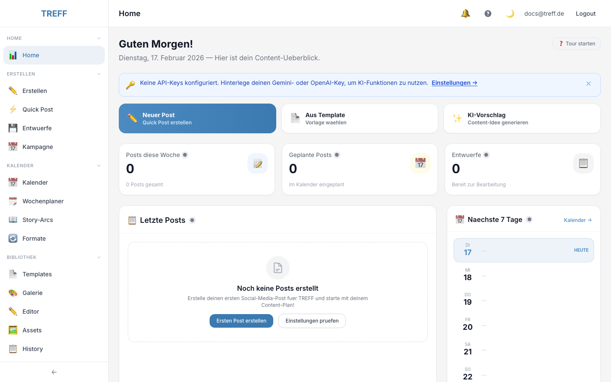
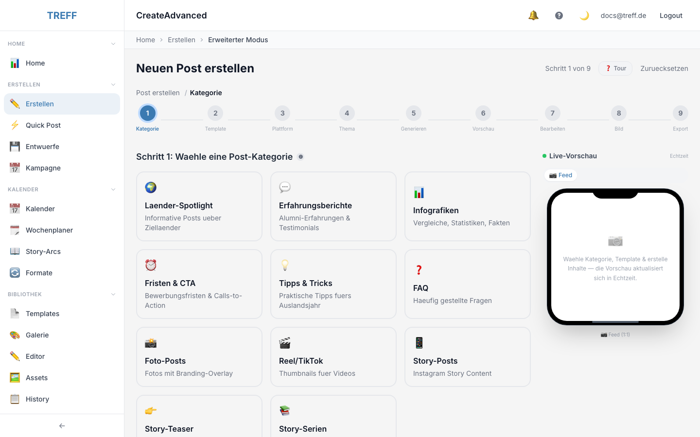
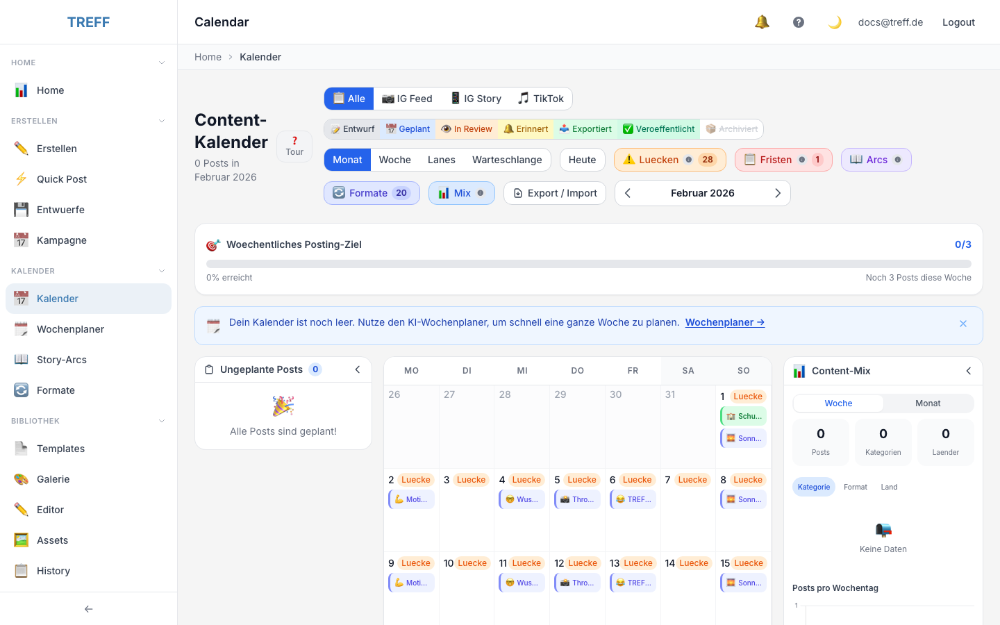
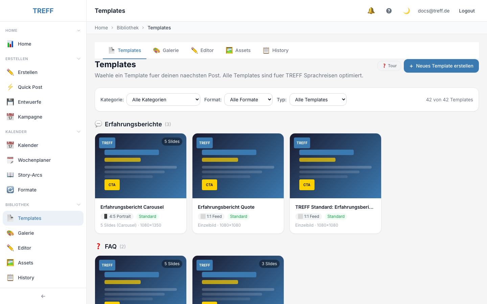
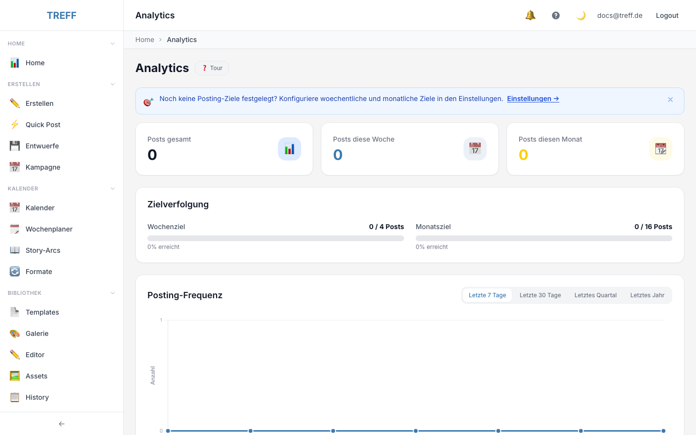

# TREFF Post-Generator

> KI-gestuetztes Social-Media-Content-Tool fuer TREFF Sprachreisen — Instagram- und TikTok-Posts in Minuten statt Stunden erstellen.

<p align="center">
  <strong>TREFF Sprachreisen</strong> · Highschool-Aufenthalte seit 1984<br/>
  USA · Kanada · Australien · Neuseeland · Irland
</p>

---

## Screenshots

| Dashboard | Post-Creator | Kalender |
|:---------:|:------------:|:--------:|
|  |  |  |

| Templates | Analytics |
|:---------:|:---------:|
|  |  |

---

## Ueberblick

Der **TREFF Post-Generator** ist ein internes Web-Tool, mit dem die Social-Media-Mitarbeiterin von TREFF Sprachreisen konsistente, hochwertige Instagram- und TikTok-Posts erstellen kann. Das Tool kombiniert KI-Textgenerierung, KI-Bildgenerierung, anpassbare HTML/CSS-Templates, einen Content-Kalender und ein Analytics-Dashboard.

### Kern-Features

| Feature | Beschreibung |
|---------|-------------|
| **KI-Textgenerierung** | Slide-Headlines, Captions und Hashtags via Google Gemini 3 Flash |
| **KI-Bildgenerierung** | Gebrandete Hintergruende und Visuals via Gemini 3 Pro Image |
| **Template-System** | 9 Post-Kategorien mit vorgefertigten, anpassbaren HTML/CSS-Templates |
| **Live-Preview** | WYSIWYG-Vorschau mit Echtzeit-Bearbeitung |
| **Content-Kalender** | Drag & Drop-Planung, Wochenplaner, Story-Arcs, Wiederkehrende Formate |
| **Video-Tools** | Thumbnail-Generator, Overlay-Editor, Video-Composer, Script-Generator, Audio-Mixer |
| **Asset-Bibliothek** | Upload, Crop, Tagging, Unsplash/Pexels-Integration |
| **Analytics-Dashboard** | Posting-Frequenz, Content-Mix, Engagement-Tracking |
| **Kampagnen** | Multi-Post-Kampagnen mit KI-Planvorschlaegen |
| **Schueler-Pipeline** | Content von Schueler-Einreichungen verarbeiten und multiplizieren |

### Post-Kategorien

1. **Laender-Spotlight** — Laenderspezifische Infoposts
2. **Erfahrungsberichte** — Alumni-Testimonials
3. **Infografiken** — Visuelle Daten und Vergleiche
4. **Fristen & CTA** — Deadline-Ankuendigungen
5. **Tipps & Tricks** — Praktische Ratschlaege
6. **FAQ** — Haeufig gestellte Fragen
7. **Foto-Posts** — Schuelerfotos mit Branding
8. **Reel/TikTok Thumbnails** — Video-Coverbilder
9. **Story-Posts** — Instagram Story Content

---

## Tech-Stack

| Schicht | Technologie | Version |
|---------|-------------|---------|
| **Frontend** | Vue.js 3 (Composition API, `<script setup>`) | ^3.5 |
| **Styling** | Tailwind CSS | ^3.4 |
| **State** | Pinia | ^2.3 |
| **Routing** | Vue Router | ^4.5 |
| **Build** | Vite | ^6.0 |
| **Kalender** | FullCalendar (Vue 3) | ^6.1 |
| **Charts** | Chart.js + vue-chartjs | ^4.4 / ^5.3 |
| **Drag & Drop** | vuedraggable | ^4.1 |
| **Screenshot** | html2canvas | ^1.4 |
| **ZIP-Export** | JSZip | ^3.10 |
| **Backend** | Python 3.11+ / FastAPI | ^0.115 |
| **ORM** | SQLAlchemy (async) + Alembic | ^2.0 / ^1.13 |
| **Datenbank** | SQLite (via aiosqlite) | — |
| **KI (Text)** | Google Gemini 3 Flash (`google-genai`) | ^1.0 |
| **KI (Bild)** | Google Gemini 3 Pro Image | — |
| **KI (Fallback)** | OpenAI GPT (optional) | ^1.3 |
| **Auth** | JWT (PyJWT + bcrypt) | — |
| **HTTP-Client** | httpx (async) | ^0.28 |
| **Bildbearbeitung** | Pillow | ^10.0 |
| **Deployment** | Vercel (Serverless) | — |

---

## Projektstruktur

```
treff/
├── api/
│   └── index.py                    # Vercel Serverless Function Entry-Point
├── backend/
│   ├── app/
│   │   ├── api/routes/             # FastAPI Route-Handler (35+ Module)
│   │   │   ├── ai.py              #   KI-Text & Bildgenerierung
│   │   │   ├── analytics.py       #   Dashboard-Statistiken
│   │   │   ├── assets.py          #   Medienverwaltung & Upload
│   │   │   ├── auth.py            #   Registrierung, Login, JWT
│   │   │   ├── calendar.py        #   Kalender-CRUD, Import/Export
│   │   │   ├── campaigns.py       #   Kampagnen-Management
│   │   │   ├── posts.py           #   Post-CRUD, Status-Workflow
│   │   │   ├── templates.py       #   Template-CRUD, Duplikation
│   │   │   ├── students.py        #   Schueler-Verwaltung
│   │   │   ├── video_*.py         #   Video-Tools (6 Module)
│   │   │   └── ...                #   +25 weitere Routen
│   │   ├── core/                   # Konfiguration & Infrastruktur
│   │   │   ├── config.py          #   Pydantic Settings (Env-Vars)
│   │   │   ├── database.py        #   Async SQLAlchemy Engine
│   │   │   ├── security.py        #   JWT-Token & Passwort-Hashing
│   │   │   ├── strategy_loader.py #   Content-Strategie-Integration
│   │   │   ├── text_generator.py  #   KI-Abstraktion (Gemini/OpenAI)
│   │   │   ├── cache.py           #   Caching-Layer
│   │   │   ├── rate_limiter.py    #   API Rate-Limiting
│   │   │   ├── sanitizer.py       #   Input-Sanitization
│   │   │   └── seed_*.py          #   Datenbank-Seed-Scripts (9 Module)
│   │   ├── models/                 # SQLAlchemy ORM-Modelle (29 Tabellen)
│   │   │   ├── user.py            #   Benutzer & Auth
│   │   │   ├── post.py            #   Posts mit Status-Workflow
│   │   │   ├── template.py        #   HTML/CSS-Templates
│   │   │   ├── asset.py           #   Medien-Assets
│   │   │   ├── campaign.py        #   Kampagnen
│   │   │   ├── student.py         #   Schueler-Daten
│   │   │   ├── video_*.py         #   Video-Modelle (4 Tabellen)
│   │   │   └── ...                #   +20 weitere Modelle
│   │   ├── schemas/                # Pydantic Request/Response-Schemas
│   │   ├── services/               # Business-Logik
│   │   │   ├── content_analyzer.py
│   │   │   ├── content_multiplier.py
│   │   │   └── task_manager.py
│   │   ├── prompts/                # KI-Prompt-Templates
│   │   └── static/uploads/         # User-Uploads & Exporte
│   ├── migrations/                 # Alembic-Migrationen
│   ├── alembic.ini
│   ├── .env.example
│   └── requirements.txt
├── frontend/
│   ├── src/
│   │   ├── views/                  # Seiten-Komponenten (35 Views)
│   │   │   ├── DashboardView.vue  #   Home-Dashboard
│   │   │   ├── CreatePostView.vue #   9-Schritt Post-Wizard (Advanced)
│   │   │   ├── PostCreatorView.vue#   Quick/Smart Post-Creator
│   │   │   ├── CalendarView.vue   #   Content-Kalender
│   │   │   ├── TemplatesView.vue  #   Template-Verwaltung
│   │   │   ├── AssetsView.vue     #   Asset-Bibliothek
│   │   │   ├── AnalyticsView.vue  #   Analytics-Dashboard
│   │   │   ├── SettingsView.vue   #   App-Einstellungen
│   │   │   ├── Video*View.vue     #   Video-Tools (7 Views)
│   │   │   └── ...                #   +25 weitere Views
│   │   ├── components/             # Wiederverwendbare Komponenten
│   │   │   ├── common/            #   Generische UI (Toast, Modal, EmptyState, ...)
│   │   │   ├── layout/            #   App-Shell (TopBar, Sidebar, AppLayout)
│   │   │   ├── posts/             #   Post-spezifische Komponenten
│   │   │   ├── calendar/          #   Kalender-Komponenten
│   │   │   ├── dashboard/         #   Dashboard-Widgets
│   │   │   ├── analytics/         #   Chart-Komponenten
│   │   │   ├── creator/           #   Post-Creator-Module
│   │   │   ├── assets/            #   Asset-Browser
│   │   │   ├── templates/         #   Template-Vorschau
│   │   │   ├── students/          #   Schueler-Karten
│   │   │   ├── tasks/             #   Background-Task-UI
│   │   │   └── interactive/       #   Interaktive Elemente
│   │   ├── composables/            # Vue 3 Composition-Functions
│   │   │   ├── useApi.js          #   Axios-Wrapper mit Auth
│   │   │   ├── useAutoSave.js     #   Auto-Save mit Debounce
│   │   │   ├── useToast.js        #   Toast-Notifications
│   │   │   ├── useTour.js         #   Guided-Tour-System
│   │   │   ├── useUndoRedo.js     #   Undo/Redo-Stack
│   │   │   ├── usePostCreator.js  #   Post-Erstellungs-Logik
│   │   │   └── ...                #   +5 weitere Composables
│   │   ├── stores/                 # Pinia State-Management
│   │   │   ├── auth.js            #   Auth-State & JWT-Tokens
│   │   │   ├── contentDraft.js    #   Post-Erstellungs-Wizard-State
│   │   │   ├── campaign.js        #   Kampagnen-State
│   │   │   ├── contentPipeline.js #   Schueler-Inbox & Pipeline
│   │   │   ├── storyArc.js        #   Story-Arc-State
│   │   │   └── students.js        #   Schueler-State
│   │   ├── router/                 # Vue Router (Lazy-Loading, Auth-Guards)
│   │   ├── config/                 # App-Konfiguration
│   │   │   ├── designTokens.js    #   Design-System-Tokens
│   │   │   └── content-strategy.json  # Content-Strategie-Daten
│   │   ├── tours/                  # Guided-Tour-Konfigurationen
│   │   ├── utils/                  # Hilfsfunktionen
│   │   │   ├── api.js             #   Axios-Instanz & Interceptors
│   │   │   └── tooltipTexts.js    #   Tooltip-Texte
│   │   └── assets/                 # Statische Assets (CSS, Bilder)
│   ├── package.json
│   └── vite.config.js
├── docs/
│   ├── content-strategy.md         # Content-Strategie-Dokumentation
│   └── social-content-strategy.md  # Social-Media-Strategie
├── init.sh                         # Development-Setup-Script
├── vercel.json                     # Vercel Deployment-Konfiguration
└── README.md
```

---

## Schnellstart

### Voraussetzungen

- **Python 3.11+** — [python.org/downloads](https://www.python.org/downloads/)
- **Node.js 18+** — [nodejs.org](https://nodejs.org/)
- **Google Gemini API Key** — [aistudio.google.com](https://aistudio.google.com/) (fuer KI-Features)

### Installation & Start

```bash
# 1. Repository klonen
git clone <repository-url>
cd treff

# 2. Setup-Script ausfuehren (installiert alles und startet Server)
chmod +x init.sh
./init.sh
```

Das Script erledigt automatisch:

1. Python Virtual Environment erstellen und Backend-Abhaengigkeiten installieren
2. Node.js Frontend-Abhaengigkeiten installieren
3. FastAPI Backend starten auf **http://localhost:8000**
4. Vite Dev-Server starten auf **http://localhost:5173**

### Manueller Start (alternativ)

```bash
# Backend
cd backend
python3 -m venv venv
source venv/bin/activate
pip install -r requirements.txt
python -m uvicorn app.main:app --host 0.0.0.0 --port 8000 --reload

# Frontend (neues Terminal)
cd frontend
npm install
npm run dev -- --host 0.0.0.0 --port 5173
```

### Nach dem Start

| URL | Beschreibung |
|-----|-------------|
| http://localhost:5173 | Frontend (Vue.js App) |
| http://localhost:8000 | Backend (FastAPI) |
| http://localhost:8000/docs | Swagger UI — Interaktive API-Dokumentation |
| http://localhost:8000/redoc | ReDoc — Alternative API-Dokumentation |
| http://localhost:8000/api/health | Health-Check-Endpoint |

---

## Environment Variables

Kopiere `backend/.env.example` nach `backend/.env` und konfiguriere:

| Variable | Pflicht | Standard | Beschreibung |
|----------|---------|----------|-------------|
| `DATABASE_URL` | Nein | `sqlite+aiosqlite:///./treff.db` | SQLAlchemy Database-URL |
| `JWT_SECRET_KEY` | **Ja** | `dev-secret-key-...` | Geheimer Schluessel fuer JWT-Token-Signierung. In Produktion unbedingt aendern! |
| `JWT_ALGORITHM` | Nein | `HS256` | JWT-Signatur-Algorithmus |
| `ACCESS_TOKEN_EXPIRE_MINUTES` | Nein | `60` | Gueltigkeitsdauer Access-Token (Minuten) |
| `REFRESH_TOKEN_EXPIRE_DAYS` | Nein | `7` | Gueltigkeitsdauer Refresh-Token (Tage) |
| `GEMINI_API_KEY` | **Ja*** | — | Google Gemini API Key fuer KI-Text- und Bildgenerierung |
| `OPENAI_API_KEY` | Nein | — | OpenAI API Key (optionaler Fallback fuer Textgenerierung) |
| `UNSPLASH_ACCESS_KEY` | Nein | — | Unsplash API Key fuer Stock-Fotos |
| `PEXELS_API_KEY` | Nein | — | Pexels API Key fuer Stock-Fotos |
| `BACKEND_HOST` | Nein | `0.0.0.0` | Backend Server-Host |
| `BACKEND_PORT` | Nein | `8000` | Backend Server-Port |
| `FRONTEND_URL` | Nein | `http://localhost:5173` | Frontend-URL (fuer CORS) |
| `LOG_LEVEL` | Nein | `INFO` | Logging-Level (`DEBUG`, `INFO`, `WARNING`, `ERROR`) |
| `SQL_ECHO` | Nein | `False` | SQL-Queries im Log ausgeben (Debugging) |

> *Die App funktioniert auch ohne `GEMINI_API_KEY` — KI-Features sind dann deaktiviert.

### Beispiel `.env`

```env
DATABASE_URL=sqlite+aiosqlite:///./treff.db
JWT_SECRET_KEY=mein-super-geheimer-schluessel-hier-aendern
GEMINI_API_KEY=AIzaSy...
UNSPLASH_ACCESS_KEY=abc123...
LOG_LEVEL=INFO
```

---

## Architektur

### Frontend-Architektur

```
                    ┌─────────────┐
                    │  Vue Router  │  Auth-Guard, Lazy-Loading
                    │  (40 Routes) │
                    └──────┬──────┘
                           │
                    ┌──────▼──────┐
                    │    Views    │  35 Page-Level-Komponenten
                    │ (*.vue)     │  Jede View = 1 Seite
                    └──────┬──────┘
                           │
              ┌────────────┼────────────┐
              │            │            │
       ┌──────▼──────┐ ┌──▼───┐ ┌──────▼──────┐
       │ Components  │ │Stores│ │ Composables │
       │ (UI-Teile)  │ │(Pinia│ │ (Logik)     │
       │ 12 Ordner   │ │6 St.)│ │ 12 Funkt.   │
       └─────────────┘ └──┬───┘ └─────────────┘
                          │
                   ┌──────▼──────┐
                   │  useApi.js  │  Axios + JWT Interceptors
                   │  (api.js)   │
                   └──────┬──────┘
                          │
                    ┌─────▼─────┐
                    │  Backend  │  FastAPI REST API
                    │ :8000/api │
                    └───────────┘
```

**Pinia Stores** (State-Management):

| Store | Datei | Verantwortung |
|-------|-------|--------------|
| `useAuthStore` | `auth.js` | Login/Logout, JWT-Tokens, User-State |
| `useContentDraftStore` | `contentDraft.js` | 9-Schritt Post-Wizard-State |
| `useCampaignStore` | `campaign.js` | Kampagnen-CRUD, KI-Planvorschlaege |
| `useContentPipelineStore` | `contentPipeline.js` | Schueler-Inbox, Content-Verarbeitung |
| `useStoryArcStore` | `storyArc.js` | Story-Arcs & Episoden |
| `useStudentsStore` | `students.js` | Schueler-Verwaltung |

### Backend-Architektur

```
                    ┌──────────────────────────┐
                    │      FastAPI App          │
                    │   (app/main.py)           │
                    │   CORS, Middleware,       │
                    │   Startup-Events          │
                    └───────────┬──────────────┘
                                │
                 ┌──────────────┼──────────────┐
                 │              │              │
          ┌──────▼──────┐ ┌────▼────┐ ┌───────▼──────┐
          │   Routes    │ │  Core   │ │   Services   │
          │ (35 Module) │ │         │ │              │
          │ api/routes/ │ │config.py│ │content_      │
          │             │ │database │ │ analyzer.py  │
          │ - ai.py     │ │security │ │content_      │
          │ - posts.py  │ │cache.py │ │ multiplier.py│
          │ - etc.      │ │etc.     │ │task_manager  │
          └──────┬──────┘ └────┬────┘ └──────────────┘
                 │             │
          ┌──────▼──────┐ ┌───▼────────────┐
          │   Schemas   │ │    Models      │
          │  (Pydantic) │ │ (SQLAlchemy)   │
          │  Request/   │ │ 29 Tabellen    │
          │  Response   │ │                │
          └─────────────┘ └───────┬────────┘
                                  │
                           ┌──────▼──────┐
                           │   SQLite    │
                           │  treff.db   │
                           └─────────────┘
```

### Datenmodell (29 Tabellen)

Die wichtigsten Tabellen:

| Modell | Tabelle | Beschreibung |
|--------|---------|-------------|
| `User` | `users` | Benutzerkonten mit Passwort-Hash |
| `Post` | `posts` | Posts mit Status-Workflow (draft → scheduled → published) |
| `PostSlide` | `post_slides` | Einzelne Slides eines Karussell-Posts |
| `Template` | `templates` | HTML/CSS-Templates fuer Post-Kategorien |
| `Asset` | `assets` | Hochgeladene Medien (Bilder, Videos, Audio) |
| `CalendarEntry` | `calendar_entries` | Kalender-Eintraege mit Datum & Plattform |
| `Campaign` | `campaigns` | Multi-Post-Kampagnen |
| `CampaignPost` | `campaign_posts` | N:M Kampagne ↔ Post |
| `Student` | `students` | Schueler-Daten (Land, Programm, Zeitraum) |
| `StoryArc` | `story_arcs` | Mehrteilige Story-Arcs |
| `StoryEpisode` | `story_episodes` | Einzelne Episoden eines Story-Arcs |
| `RecurringFormat` | `recurring_formats` | Wiederkehrende Post-Formate |
| `RecurringPostRule` | `recurring_post_rules` | Automatisierte Post-Regeln |
| `HashtagSet` | `hashtag_sets` | Gespeicherte Hashtag-Sammlungen |
| `CTA` | `ctas` | Call-to-Action-Elemente |
| `PipelineItem` | `pipeline_items` | Content-Pipeline-Eintraege |
| `VideoOverlay` | `video_overlays` | Video-Overlay-Presets |
| `VideoTemplate` | `video_templates` | Video-Branding-Templates |
| `VideoExport` | `video_exports` | Video-Export-History |
| `VideoScript` | `video_scripts` | KI-generierte Video-Scripts |
| `MusicTrack` | `music_tracks` | Musik-Bibliothek fuer Audio-Mixer |
| `PromptHistory` | `prompt_history` | KI-Prompt-Verlauf & Favoriten |
| `ExportHistory` | `export_history` | Post-Export-Verlauf |
| `ContentSuggestion` | `content_suggestions` | KI-Content-Vorschlaege |
| `TemplateFavorite` | `template_favorites` | Favorisierte Templates pro User |
| `BackgroundTask` | `background_tasks` | Async Hintergrundaufgaben |
| `Setting` | `settings` | App-Einstellungen (Key-Value) |
| `Hook` | `hooks` | Aufhaenger-Texte fuer Posts |
| `HumorFormat` | `humor_formats` | Humor-Formate fuer KI-Texte |
| `PostInteractiveElement` | `post_interactive_elements` | Interaktive Elemente (Polls, Quizze) |
| `SeriesReminder` | `series_reminders` | Erinnerungen fuer Post-Serien |
| `PostRelation` | `post_relations` | Verknuepfungen zwischen Posts |

---

## API-Dokumentation

### Interaktive Docs

Wenn das Backend laeuft, sind die vollstaendigen API-Docs verfuegbar:

- **Swagger UI**: [http://localhost:8000/docs](http://localhost:8000/docs) — Interaktiv, zum Testen von Endpoints
- **ReDoc**: [http://localhost:8000/redoc](http://localhost:8000/redoc) — Uebersichtliche Referenz

### API-Uebersicht

Alle Endpoints liegen unter `/api/`:

| Bereich | Prefix | Beschreibung |
|---------|--------|-------------|
| **Auth** | `/api/auth/` | Register, Login, Token-Refresh, Me |
| **Posts** | `/api/posts/` | CRUD, Status-Transitions, Batch-Aktionen |
| **Slides** | `/api/slides/` | Karussell-Slide-Verwaltung |
| **Templates** | `/api/templates/` | CRUD, Duplikation, Favoriten |
| **KI** | `/api/ai/` | Text-Generierung, Bild-Generierung, Caption-Optimierung |
| **Assets** | `/api/assets/` | Upload, Crop, Metadaten, Stock-Fotos |
| **Kalender** | `/api/calendar/` | Eintraege, Import/Export (iCal), Smart-Scheduling |
| **Kampagnen** | `/api/campaigns/` | CRUD, KI-Plan-Generierung |
| **Schueler** | `/api/students/` | CRUD, Content-Pipeline |
| **Analytics** | `/api/analytics/` | Dashboard-Statistiken, Trends |
| **Story-Arcs** | `/api/story-arcs/` | CRUD, Episoden |
| **Video** | `/api/video-*/` | Templates, Overlays, Export, Scripts, Composer |
| **Audio** | `/api/audio-mixer/` | Tracks, Mixing |
| **Hashtags** | `/api/hashtag-sets/` | Hashtag-Sammlungen |
| **CTAs** | `/api/ctas/` | Call-to-Action-Elemente |
| **Settings** | `/api/settings/` | App-Konfiguration |
| **Health** | `/api/health` | Health-Check & System-Info |
| **Tasks** | `/api/tasks/` | Background-Task-Status |

### Authentifizierung

Die API nutzt **JWT Bearer Tokens**:

```bash
# 1. Registrieren
curl -X POST http://localhost:8000/api/auth/register \
  -H "Content-Type: application/json" \
  -d '{"email": "user@example.com", "password": "mindestens8zeichen", "name": "Max"}'

# 2. Login (gibt access_token + refresh_token zurueck)
curl -X POST http://localhost:8000/api/auth/login \
  -H "Content-Type: application/json" \
  -d '{"email": "user@example.com", "password": "mindestens8zeichen"}'

# 3. Authentifizierte Anfragen
curl http://localhost:8000/api/posts/ \
  -H "Authorization: Bearer <access_token>"
```

---

## Deployment

### Vercel (Produktion)

Das Projekt ist fuer **Vercel Serverless Deployment** konfiguriert:

1. **Frontend**: Wird als statische Site gebaut (`vite build`) und ueber Vercel CDN ausgeliefert
2. **Backend**: Laeuft als Serverless Function unter `/api/*` (siehe `api/index.py`)
3. **Datenbank**: SQLite in `/tmp/` (ephemerer Speicher auf Vercel)

#### Vercel Setup

```bash
# Vercel CLI installieren
npm install -g vercel

# Projekt verknuepfen und deployen
vercel

# Environment Variables in Vercel Dashboard setzen:
# - GEMINI_API_KEY
# - JWT_SECRET_KEY (starker Zufalls-String!)
# - OPENAI_API_KEY (optional)
```

#### Konfiguration (`vercel.json`)

```json
{
  "buildCommand": "cd frontend && npm install && npm run build",
  "outputDirectory": "frontend/dist",
  "functions": {
    "api/index.py": {
      "maxDuration": 60,
      "memory": 1024
    }
  },
  "rewrites": [
    { "source": "/api/:path*", "destination": "/api/index.py" },
    { "source": "/(.*)", "destination": "/index.html" }
  ]
}
```

> **Hinweis:** SQLite auf Vercel ist ephemer (Daten gehen bei Cold-Start verloren). Fuer persistente Daten empfiehlt sich Turso oder ein externer Datenbankdienst.

### Docker (Alternative)

```bash
# Beispiel docker-compose.yml (bei Bedarf erstellen)
# Frontend: Node.js Build + nginx
# Backend: Python + uvicorn
# Volume: SQLite-Datei persistieren
```

---

## Brand-Identity

| Eigenschaft | Wert |
|-------------|------|
| **Firma** | TREFF Sprachreisen |
| **Gruendung** | 1984 |
| **Standort** | Eningen u.A. / Pfullingen |
| **Zielgruppe** | Deutsche Schueler (14-18) & deren Eltern |
| **Teilnehmer/Jahr** | ~200 |
| **Primaerfarbe** | `#4C8BC2` (TREFF Blau — Vertrauen, Bildung) |
| **Sekundaerfarbe** | `#FDD000` (TREFF Gelb — Energie, Abenteuer) |
| **Akzentfarben** | `#FFFFFF`, `#1A1A2E` (Dark), `#F5F5F5` (Light) |
| **Tonalitaet** | Jugendlich aber serioees — Teenager ansprechen, Eltern ueberzeugen |
| **Plattformen** | Instagram (Feed, Stories, Reels), TikTok |

---

## Datenbank-Migrationen

Das Projekt nutzt **Alembic** fuer Schema-Migrationen:

```bash
cd backend
source venv/bin/activate

# Neue Migration erstellen
python migrate.py revision "beschreibung der aenderung"

# Migrationen ausfuehren
python migrate.py upgrade

# Status pruefen
python migrate.py current

# Rollback
python migrate.py downgrade
```

---

## Feature Flags

Das Projekt verwendet aktuell **kein Feature-Flag-System**. Alle Features sind standardmaessig aktiv. KI-Features (Textgenerierung, Bildgenerierung) werden automatisch deaktiviert, wenn der zugehoerige API-Key (`GEMINI_API_KEY` / `OPENAI_API_KEY`) nicht konfiguriert ist.

---

## Lizenz

Privat — Internes Tool von TREFF Sprachreisen. Nicht zur Weitergabe bestimmt.
